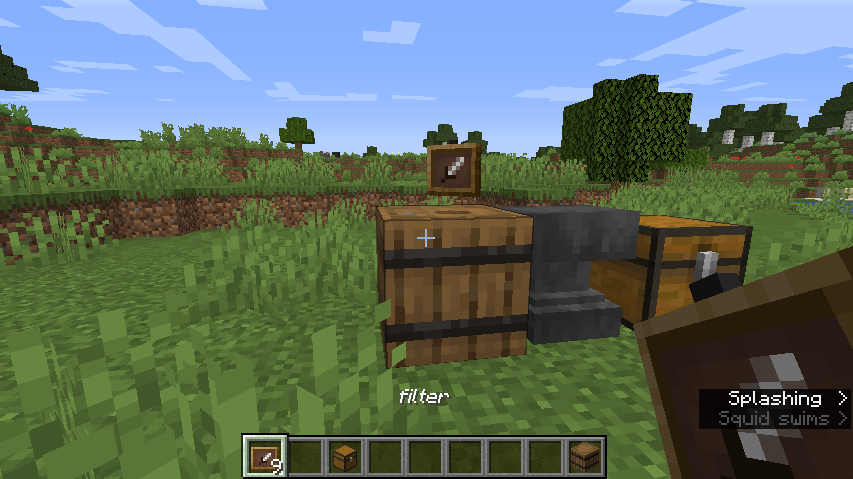

# tik_barrel
A datapack based on Mumbo Jumbo's suggestion on 1.14. His video: https://www.youtube.com/watch?v=OlCFSw5cDOA

## How does it work
* Download the datapack and move it to %AppData%/.minecraft/saves/<your_world>/datapacks  (No need to unzip the .zip file you downloaded)

* In-game, type in the chat /reload. It would tell you the datapack is on.
* To make a Tik Barrel, you need to rename an item frame to 'filter', then drop it onto a barrel. It would disappear and all that is left is to right-click with your item (every item you want will do), and try it.

The Tik Barrel will drop every item the barrel has which is not the item you have chosen.

Creating a Tik Barrel

Using a melon as a filter

Before (i disabled the datapack so you can see what is going on)

After 1 (The filtered items on the floor)

After 2 (The inventory of me & the Tik Barrel, to show it's working)

## Enjoy!
Please refer to me if you publish anything about this datapack.
Btw I didn't steal this datapack, I have 2 internet-names. tikotap and g33king :)
